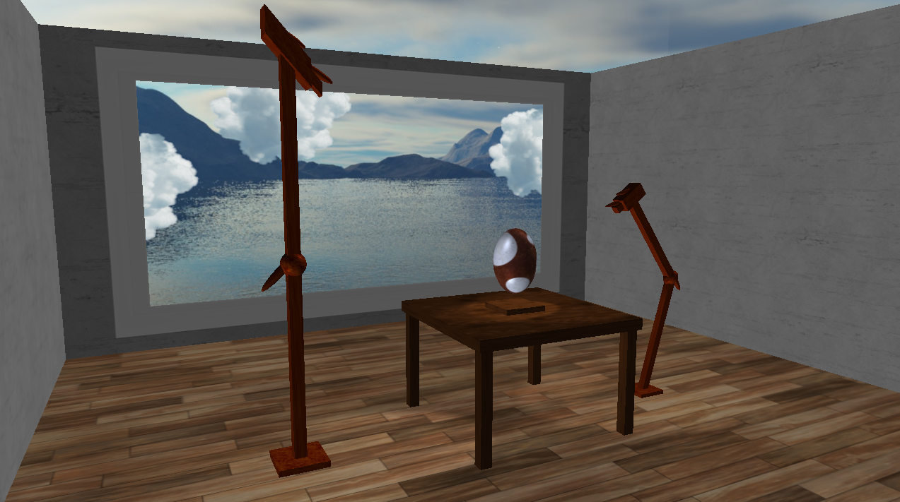

Running the program.
An executable can be found at x64/Debug/GraphicsAssignment.exe
Alternatively the code can be compiled and ran using the GraphicsAssignment.sln file. The code
was developed in Visual Studio 2019 so may not work for older versions. 

Program Infomation
Hatch.Cpp contains the majority of the code. room.vert and room.frag are the main shaders. 
skybox.vert and skybox.frag contain the skybox shader code. 

Controls:

W: Forward
A: Left
S: Back
D: Right 
Mouse: Direction
Mouse-Scroll: Zoom

E: Lamp 2 Pose Transitions
R: Lamp 1 Pose Transitions
Q: Directional Light, on/off
T: Lamp 1 on/off
Y: Lamp 2 on/off
